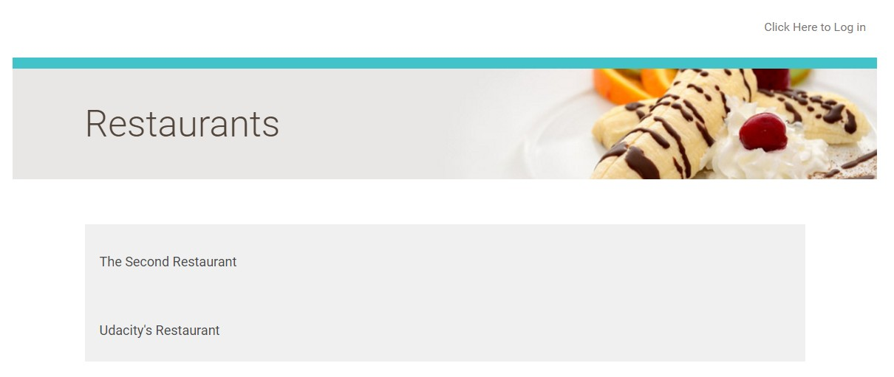

# Linux-Server-Configuration
Linux Server Configuration Program for udacity FSND.

Linux distribution on a virtual machine, prepared to host web applications, install updates and securing it from a number of attack vectors.
## Preview

Project Access

IP address: 35.160.205.21

SSH Port: 2200

Web Application URL: http://35.160.205.21/

AWS-Server: http://ec2-35-160-205-21.us-west-2.compute.amazonaws.com

  Package Name | Description
  --------------: | :------------
  **finger:** | Displays an easy to read information about a user
  **apache2** | HTTP Server
  **libapache2-mod-wsgi** | hosts Python applications on Apache2 server
  **ntp** | Synchronizes time over a network
  **postgresql** | Postgresql Database server
  **git** | Version control system tools
  **python-setuptools** | An easy-install package to facilitate installing Python packages
  **sqlalchemy** | ORM and SQL tools for Python
  **flask** | Microframework for web applications
  **python-psycopg2** | PostgreSQL adapter for Python
  **oauth2** | Authorization framework for third-party login (Google and Facebook)
  **google-api-python-client** | Google API for OAuth login
  **fail2ban** | Protection against suspicious site activity by IP banning
  **Glances** | Application monitor for host bugs
  **GitHub-Flask** | Application monitor for host bugs

## Step by Step
  1.Launch your Virtual Machine with your Udacity account and log in. 

  You can manage your virtual server at: https://www.udacity.com/account#!/development_environment (you must a member in udacity nano degree)
  2.Create a new user named grader and grant this user sudo permissions.

  3.Update all currently installed packages.

  4.Configure the local timezone to UTC.

  It is very easy to inadvertently lock yourself out of the server. If this happens you will have to delete your server and start from scratch. Complete these steps before proceeding, and double check every command before running it!
  5.Change the SSH port from 22 to 2200

  6.Configure the Uncomplicated Firewall (UFW) to only allow incoming connections for SSH (port 2200), HTTP (port 80), and NTP (port 123)

  7.Install and configure Apache to serve a Python mod_wsgi application

  8.Install and configure PostgreSQL:

  9.Do not allow remote connections

  10.Create a new user named catalog that has limited permissions to your catalog application database

  11.Install git, clone and set up your Catalog App project (from your GitHub repository from earlier in the Nanodegree program) so that 
  it functions correctly when visiting your server’s IP address in a browser. Remember to set this up appropriately so that your .git 
  directory is not publicly accessible via a browser!

  12.Your Amazon EC2 Instance's public URL will look something like this: http://ec2-XX-XX-XXX-XXX.us-west-2.compute.amazonaws.com/ where the X's are replaced with your instance's IP address. You can use this url when configuring third party authentication. Please note the the IP address part of the AWS URL uses dashes, not dots.
